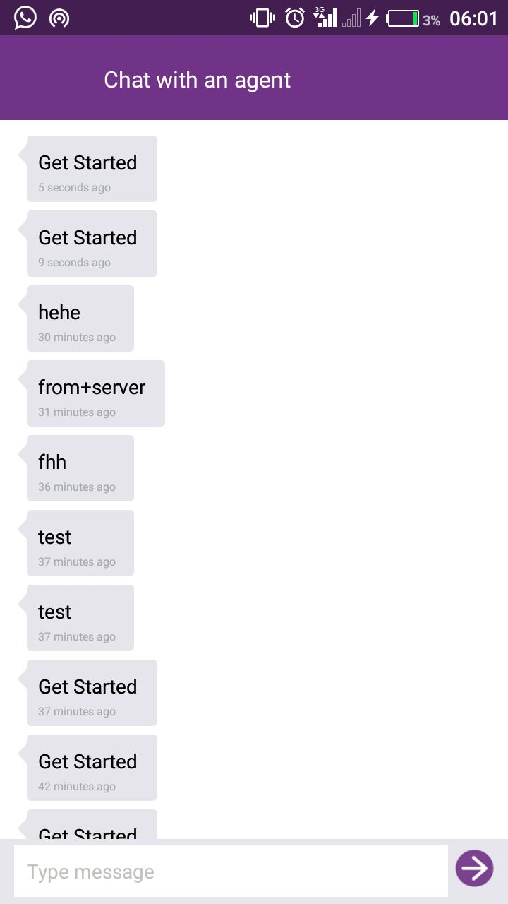

# Ongair Limited - in app support library
Ongair Limited Android SDK

#Screenshots



#Quick Setup Instructions

TO INTEGRATE THIS LIBRARY INTO YOUR ANDROID APP, PLEASE FOLOW THE FOLLOWING FEW STEPS

1. Import the library into your IDE

2. Reference the library from your project

3. After doing the above, go ahead and open your AndroidManifest.xml and follow the below steps

 a) Pleas add the following permissions if they do not exist yet:
    ```<uses-permission android:name="android.permission.INTERNET" />
    <uses-permission
        android:name="android.permission.ACCESS_NETWORK_STATE"
        android:allowBackup="true" />
    <uses-permission android:name="android.permission.READ_PHONE_STATE" />
    <uses-permission android:name="android.permission.WRITE_EXTERNAL_STORAGE" />
    <uses-permission android:name="android.permission.ACCESS_COARSE_LOCATION" />
    <uses-permission android:name="android.permission.WRITE_SYNC_SETTINGS" />
    <uses-permission android:name="android.permission.WAKE_LOCK" />
    <uses-permission android:name="android.permission.VIBRATE" />
    <uses-permission android:name="android.permission.RECEIVE_BOOT_COMPLETED" />

    <!-- Read Phone State -->
    <uses-permission android:name="android.permission.READ_PHONE_STATE" />

    <!-- This app has permission to register and receive data message. -->
    <uses-permission android:name="com.google.android.c2dm.permission.RECEIVE" />

    <permission
        android:name="com.ongair.im.permission.C2D_MESSAGE"
        android:protectionLevel="signature" />

    <uses-permission android:name="com.ongair.im.permission.C2D_MESSAGE" />
```	
	
 b) After adding the permissions, please paste the below code somewhere within your <application></application> tags in your Android    Manifest.xml:

```
  <!--Initialize Ongair Library-->
 <receiver
            android:name="com.google.android.gms.gcm.GcmReceiver"
            android:exported="true"
            android:permission="com.google.android.c2dm.permission.SEND">
            <intent-filter>
                <action android:name="com.google.android.c2dm.intent.RECEIVE" />

                <category android:name="com.ongair.im" />
            </intent-filter>
        </receiver>

        <service
            android:name="com.ongair.im.services.GcmIntentService"
            android:exported="false">
            <intent-filter>
                <action android:name="com.google.android.gms.iid.InstanceID" />
            </intent-filter>
        </service>
        <service
            android:name="com.ongair.im.receivers.GcmPushReceiver"
            android:exported="false">
            <intent-filter>
                <action android:name="com.google.android.c2dm.intent.RECEIVE" />
                <category android:name="com.ongair.im" />
            </intent-filter>
        </service>

  
           <activity
            android:name="com.ongair.im.ui.LoginActivity"
            android:label="@string/app_name">
            
        </activity>

        <activity
            android:name="com.ongair.im.ui.ConversationThreadActivity"
            android:label="@string/app_name">
        </activity>
        <activity
            android:name="com.ongair.im.ui.UploadActivity"
            android:label="@string/app_name">
        </activity>

     
        
        <meta-data android:name="ONGAIR_API_KEY"
           android:value="your_api_key_here"/>
		   
   <!--End Initialize Ongair Library-->
  ``` 
   
 4. In step 3(b) please note the the Ongair API key section. You need to paste your API key so as to start pushing out surveys to users.
     
	 a) To get your API key, please go to http://ongair.im , register an account and go to the settings. 
	 b) Copy the token key and  paste this into the following section in you AndroidManifest.xml:
	 	 
        <meta-data android:name="ONGAIR_API_KEY"
           android:value="your_api_key_here"/>

5.Add the following code in the ``` onCreate ``` of your app's Main Activity or Splash Activity to initialize Ongair Limited on opening the app: 
	
	```
	Intent OL = new Intent(this, com.ongair.im.ui.LoginActivity.class);
		 this.startService(OL);
	```


6. Create bundle and pass a string of the logged in user.
       
	 ```
     Intent i = new Intent(yourclass.this, ConversationThreadActivity.class);
     i.putExtra("name","Carolyne");
     startActivity(i);
     finish();
	``` 
		   
7. After step 6 above, please go ahead and run your Android App, you can now update the apk on google play/store and have real time chat with your customers.
     


